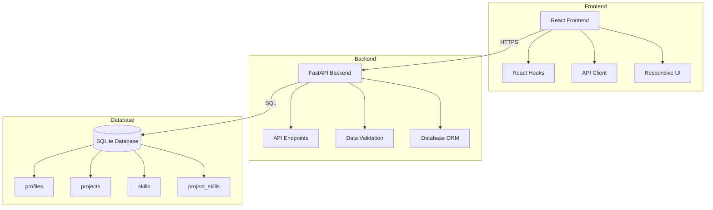
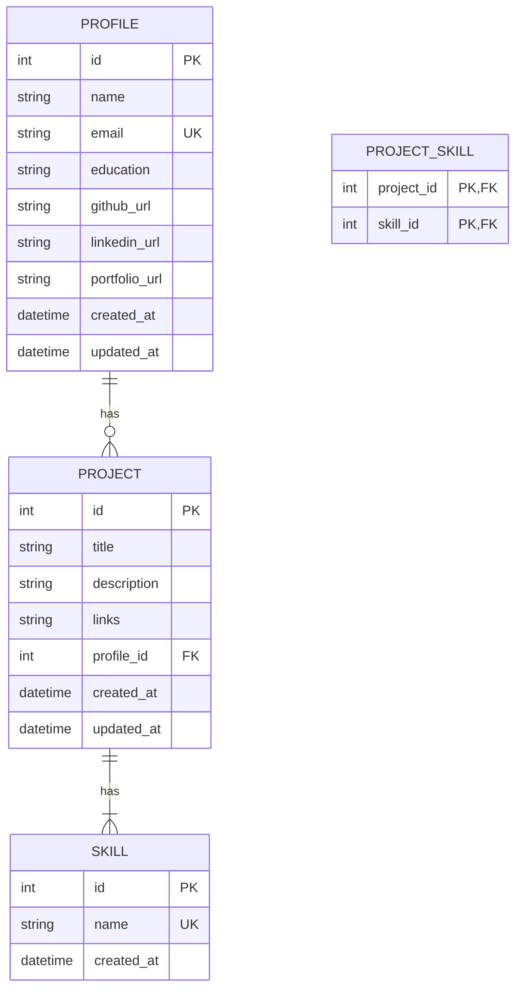

# 🚀 Me-API Playground

## 📌 Overview
Me-API Playground is a full-stack application that serves as a professional portfolio platform. It features a FastAPI backend with a React frontend, demonstrating modern API design, efficient database modeling, and clean architecture.

## � Key Features
- **Profile Management**: Showcase professional information and skills
- **Project Showcase**: Display projects with skill-based filtering
- **Health Check**: Monitor API status with `/health` endpoint
- **Responsive Design**: Works on desktop and mobile devices

## �🌐 Live Deployment

| Environment | URL | Status |
|-------------|-----|--------|
| Production API | [https://api-jd.onrender.com](https://api-jd.onrender.com) | [](https://api-jd.onrender.com/health) |
| Frontend | [https://api-jd.vercel.app](https://api-jd.vercel.app) | [](https://api-jd.vercel.app) |

## 🏗️ System Architecture



### Key Components
- **Frontend**: React 18 with Vite
- **Backend**: FastAPI (Python 3.10+)
- **Database**: SQLite with SQLAlchemy ORM
- **API Documentation**: OpenAPI (Swagger UI)
- **Hosting**: Vercel (Frontend), Render (Backend)

## 🏗️ System Architecture

### Frontend
- **Framework**: React 18 + Vite
- **State Management**: React Hooks
- **Styling**: CSS Modules
- **Build Tool**: Vite 4.x

### Backend
- **Framework**: FastAPI (Python 3.10+)
- **Database**: SQLite (development), PostgreSQL (production)
- **ORM**: SQLAlchemy
- **API Documentation**: OpenAPI (Swagger UI)

### Hosting
- **Frontend**: Vercel
- **Backend**: Render
- **Database**: SQLite (development), PostgreSQL (production)

## 🛠️ Technology Stack

### Backend
- **Framework**: FastAPI (Python 3.10+)
- **Database**: SQLite with SQLAlchemy ORM
- **API Documentation**: OpenAPI (Swagger UI)
- **Testing**: Pytest
- **Dependency Management**: Poetry

### Frontend
- **Framework**: React 18
- **Build Tool**: Vite 4.x
- **State Management**: React Hooks
- **Styling**: CSS Modules
- **Package Manager**: npm / yarn

### DevOps
- **Version Control**: Git
- **CI/CD**: GitHub Actions
- **Backend Hosting**: Render
- **Frontend Hosting**: Netlify
- **Containerization**: Docker (optional)

## 🔌 API Endpoints

### Base URL
```
https://api-jd.onrender.com
```

### Health Check
```http
GET /health
```
Response:
```json
{
  "status": "ok"
}
```

### List Projects
```http
GET /api/v1/projects
```

### Filter Projects by Skill
```http
GET /api/v1/projects?skill=python
```

### Get Profile
```http
GET /api/v1/profile
```

### Profile
```http
GET /profile
```
Returns the profile information including name, email, and education.

### Projects
```http
GET /projects
```
List all projects.

#### Filter by Skill
```http
GET /projects?skill=python
```
Filter projects by skill (case-insensitive).

### Search
```http
GET /search?q=react
```
Search across projects and skills.

### Example cURL
```bash
# Get profile
curl https://api-jd.onrender.com/profile

# Get projects with Python
curl "https://api-jd.onrender.com/projects?skill=python"

# Health check
curl https://api-jd.onrender.com/health
```

## 🗃️ Database Schema

### Profiles
- `id` (Integer, Primary Key)
- `name` (String)
- `email` (String, Unique)
- `education` (String)

### Projects
- `id` (Integer, Primary Key)
- `title` (String)
- `description` (String)
- `links` (String, JSON)
- `profile_id` (Integer, Foreign Key to profiles.id)

### Skills
- `id` (Integer, Primary Key)
- `name` (String, Unique)

### Project-Skills (Junction Table)
- `project_id` (Integer, Foreign Key to projects.id)
- `skill_id` (Integer, Foreign Key to skills.id)

## 🗃️ Database Schema

### Entity Relationship Diagram



### Schema Details
- **Profiles**: Stores user profile information
- **Projects**: Contains project details and relationships
- **Skills**: Tracks technical skills with many-to-many relationship to projects
- **Project_Skills**: Junction table for projects and skills relationship
```
Profile
  - id: int (PK)
  - name: str
  - email: str
  - education: str
  - created_at: datetime
  - updated_at: datetime

Project
  - id: int (PK)
  - title: str
  - description: str
  - links: str
  - created_at: datetime
  - updated_at: datetime

Skill
  - id: int (PK)
  - name: str (unique)
  - created_at: datetime

ProjectSkill (association table)
  - project_id: int (FK to Project)
  - skill_id: int (FK to Skill)
```

## Database Seeding
The database is seeded using `seed.py` with real profile, skills, and project data.

## Design Notes
- SQLite used for simplicity and fast setup
- Minimal frontend by design (backend-focused assessment)
- No authentication implemented due to scope

## Trade-offs
- Used SQLite for development simplicity instead of a production-grade database
- Basic error handling without detailed error messages
- No rate limiting or request throttling
- No authentication/authorization layer

## ⚠️ Current Limitations

### API Limitations
- No authentication/authorization layer
- Limited input validation
- No rate limiting
- No request/response compression
- Limited error handling

### Frontend Limitations
- Basic UI with minimal styling
- No loading states
- Limited error handling
- No offline support
- No service worker for PWA capabilities

### Database Limitations
- SQLite may not scale for high traffic
- No read replicas
- Limited query optimization
- No database migrations
- No user authentication
- Limited input validation
- No pagination for large result sets
- No caching layer
- Search is case-sensitive

## 🚧 Future Enhancements

### High Priority
- [ ] Implement JWT-based authentication
- [ ] Add rate limiting and request throttling
- [ ] Implement comprehensive input validation
- [ ] Add API versioning support
- [ ] Set up monitoring and alerting

### Medium Priority
- [ ] Add pagination for list endpoints
- [ ] Implement caching layer with Redis
- [ ] Add comprehensive test coverage
- [ ] Set up CI/CD pipeline
- [ ] Add API documentation with Swagger/OpenAPI

### Low Priority
- [ ] Containerize with Docker
- [ ] Add database migrations
- [ ] Implement WebSocket for real-time updates
- [ ] Add social authentication
- [ ] Implement file upload functionality
- Add authentication & authorization
- Implement pagination and caching
- Enhance input validation
- Add API versioning
- Add more comprehensive test coverage
- Implement rate limiting
- Add API documentation with Swagger/OpenAPI
- Add logging and monitoring
- Containerize the application with Docker

## 🚀 Getting Started

### Prerequisites

- Python 3.10+
- Node.js 18+ LTS
- npm (v9+) or yarn (v1.22+)
- Git

### Local Development Setup

#### 1. Clone the Repository
```bash
git clone https://github.com/your-username/me-api-playground.git
cd me-api-playground
```

#### 2. Backend Setup

```bash
# Create and activate virtual environment
python -m venv venv
# Windows
.\venv\Scripts\activate
# Unix/macOS
source venv/bin/activate

# Install dependencies
cd backend
pip install -r requirements.txt

# Set up environment variables
cp .env.example .env
# Edit .env with your configuration

# Run database migrations
alembic upgrade head

# Start the development server
uvicorn app.main:app --reload
```

The API will be available at `http://localhost:8000`

#### 3. Frontend Setup

```bash
# Navigate to frontend directory
cd ../frontend

# Install dependencies
npm install

# Set up environment variables
cp .env.example .env.local
# Edit .env.local with your configuration

# Start the development server
npm run dev
```

The frontend will be available at `http://localhost:5173`

### Running Tests

#### Backend Tests
```bash
# Run all tests
pytest

# Run tests with coverage report
pytest --cov=app tests/
```

#### Frontend Tests
```bash
# Run unit tests
npm test

# Run end-to-end tests
npm run test:e2e
```

### Prerequisites
- Python 3.8+
- Node.js 16+
- npm or yarn

### Backend Setup
1. Create and activate virtual environment:
   ```bash
   python -m venv venv
   source venv/bin/activate  # On Windows: .\venv\Scripts\activate
   ```

2. Install dependencies:
   ```bash
   cd backend
   pip install -r requirements.txt
   ```

3. Set up environment variables:
   ```bash
   cp .env.example .env
   ```

4. Run the backend:
   ```bash
   uvicorn app.main:app --reload
   ```

### Frontend Setup
1. Navigate to frontend directory:
   ```bash
   cd frontend
   ```

2. Install dependencies:
   ```bash
   npm install
   ```

3. Set up environment variables:
   ```bash
   cp .env.example .env
   ```

4. Run the frontend:
   ```bash
   npm run dev
   ```

## ☁️ Production Deployment

### Backend Deployment (Render)

1. **Prerequisites**
   - Render account
   - GitHub repository connected to Render
   - Environment variables configured

2. **Deployment Steps**
   - Push your code to the main branch
   - Render will automatically detect the Python project
   - Configure build and start commands:
     ```
     Build: pip install -r requirements.txt
     Start: uvicorn app.main:app --host 0.0.0.0 --port $PORT
     ```
   - Set environment variables in Render dashboard
   - Deploy the service

### Frontend Deployment (Netlify)

1. **Prerequisites**
   - Netlify account
   - GitHub repository connected to Netlify

2. **Deployment Steps**
   - Connect your GitHub repository to Netlify
   - Configure build settings:
     - Build command: `npm run build`
     - Publish directory: `dist`
   - Set environment variables in Netlify UI
   - Deploy the site

### Environment Variables

#### Backend (`.env`)
```env
# App
ENVIRONMENT=production
SECRET_KEY=your-secret-key
CORS_ORIGINS=https://your-frontend-domain.com

# Database
DATABASE_URL=sqlite:///./app.db

# Logging
LOG_LEVEL=INFO
```

#### Frontend (`.env.production`)
```env
VITE_API_BASE_URL=https://your-api-domain.com
VITE_ENV=production
```

### Backend Deployment (Render)
1. Push code to GitHub repository
2. Create new Web Service on Render
3. Connect GitHub repository
4. Configure build and start commands:
   - Build: `pip install -r requirements.txt`
   - Start: `uvicorn app.main:app --host 0.0.0.0 --port 8000`
5. Set environment variables in Render dashboard
6. Deploy

### Frontend Deployment (Netlify)
1. Push code to GitHub repository
2. Connect repository to Netlify
3. Set build settings:
   - Build command: `npm run build`
   - Publish directory: `dist`
4. Set environment variables in Netlify dashboard
5. Deploy

## Live URLs
- **Backend API**: [https://your-render-app.onrender.com](https://your-render-app.onrender.com)
- **Frontend**: [https://your-netlify-app.netlify.app](https://your-netlify-app.netlify.app)

## Resume
[Your Resume Link](https://drive.google.com/your-resume-link)

## Remarks
- The application demonstrates CRUD operations for a profile and projects
- Implements filtering and search functionality
- Follows RESTful API design principles
- Includes basic error handling and validation
- SQLite chosen for simplicity
- Minimal UI by design
- With more time, would add auth, pagination, and caching

### Search
- `GET /api/v1/search?q=query` - Search for projects and skills

## Setup

### Prerequisites
- Python 3.10+
- pip
- SQLite

### Backend Setup

1. Create and activate a virtual environment:
   ```bash
   python -m venv venv
   source venv/bin/activate  # On Windows: .\venv\Scripts\activate
   ```

2. Install dependencies:
   ```bash
   cd backend
   pip install -r requirements.txt
   ```

3. Initialize the database:
   ```bash
   python -c "from app.db.init_db import init_db, seed_db; init_db(); seed_db()"
   ```

4. Run the development server:
   ```bash
   uvicorn app.main:app --reload
   ```

### Frontend Setup

1. Install Node.js dependencies:
   ```bash
   cd frontend
   npm install
   ```

2. Start the development server:
   ```bash
   npm run dev
   ```

## Running Tests

```bash
cd backend
pytest -v
```

## Deployment

### Backend

The backend can be deployed using Docker:

```bash
docker build -t me-api-backend .
docker run -d -p 8000:8000 me-api-backend
```

### Frontend

Build the frontend for production:

```bash
cd frontend
npm run build
```

## Live URLs

- **Frontend**: [https://me-api-playground.vercel.app](https://me-api-playground.vercel.app)
- **Backend**: [https://me-api-backend.onrender.com](https://me-api-backend.onrender.com)

## Resume

[View my resume](https://drive.google.com/your-resume-link)

## Remarks

- Used SQLite for simplicity in development
- Minimal UI by design to focus on backend functionality
- Would add authentication, rate limiting, and caching in a production environment
